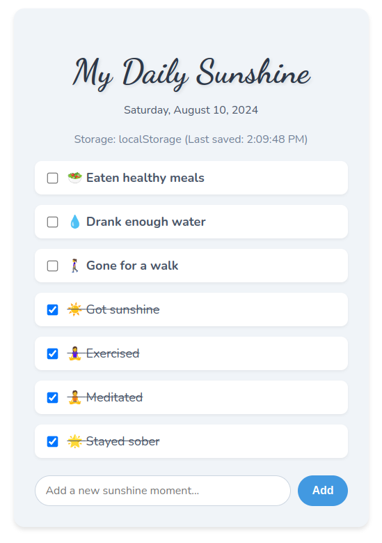

# My Daily Sunshine 🌞

My Daily Sunshine is a delightful React-based web application designed to help you track and celebrate your daily positive habits and moments. With a clean, intuitive interface and local storage capabilities, it's the perfect companion for anyone looking to maintain a healthy, balanced lifestyle.



## Features

- 📝 Pre-populated list of common healthy habits
- ➕ Add custom "sunshine moments" to your list
- ✅ Mark items as completed with a simple checkbox
- 💾 Automatic saving to localStorage (when available)
- 📱 Responsive design for both desktop and mobile use
- 🎨 Beautiful, clean UI with custom fonts and smooth animations

## Getting Started

### Prerequisites

- Node.js (version 12.0 or later recommended)
- npm or yarn

### Installation

1. Clone the repository:
   ```
   git clone https://github.com/yourusername/my-daily-sunshine.git
   ```

2. Navigate to the project directory:
   ```
   cd my-daily-sunshine
   ```

3. Install dependencies:
   ```
   npm install
   ```
   or if you're using yarn:
   ```
   yarn install
   ```

4. Start the development server:
   ```
   npm start
   ```
   or with yarn:
   ```
   yarn start
   ```

5. Open your browser and visit `http://localhost:3000` to see the app in action!

## Usage

- Check off items as you complete them throughout your day
- Add new custom items using the input field at the bottom of the list
- Your progress is automatically saved in your browser's local storage

## Acknowledgments

- Emoji graphics provided by [Twemoji](https://twemoji.twitter.com/)
- Fonts: "Dancing Script" and "Nunito" from Google Fonts

Enjoy your daily dose of sunshine! ☀️